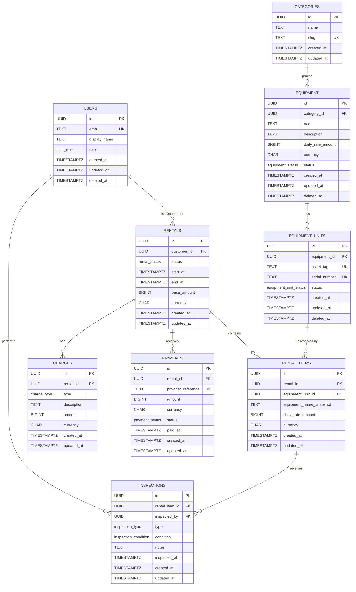
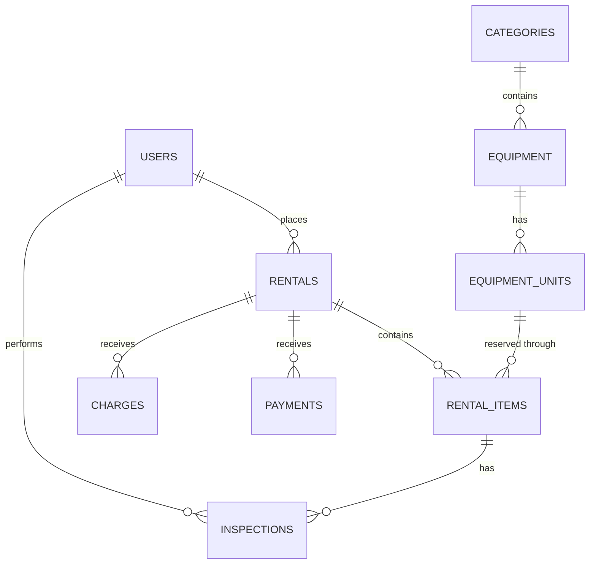

# Data Model and PostgreSQL Proof

## Implementation baseline

`database/migrations/001_initial_schema.sql` implements the nine entities in one transaction. It assumes a supported PostgreSQL server with permission to install `pgcrypto`; UUID defaults use `gen_random_uuid()`.

The migration, deterministic demo seed, five assessment queries, three rejection scripts, separate query-plan fixture, and two `EXPLAIN (ANALYZE, BUFFERS)` scripts are validated against a clean PostgreSQL 17 database. The executable evidence retains no test rows from the rejection scripts and does not change planner settings.

## Naming and common conventions

Documentation often uses conceptual camelCase names. Physical PostgreSQL names use `snake_case`.

| Conceptual name | Physical name |
| --- | --- |
| `User` | `users` |
| `Category` | `categories` |
| `Equipment` | `equipment` |
| `EquipmentUnit` | `equipment_units` |
| `Rental` | `rentals` |
| `RentalItem` | `rental_items` |
| `Inspection` | `inspections` |
| `Charge` | `charges` |
| `Payment` | `payments` |

- Every primary key is a generated `UUID` named `id`.
- All timestamps use `TIMESTAMPTZ`.
- `created_at` defaults to `CURRENT_TIMESTAMP`; a shared `BEFORE UPDATE` trigger sets `updated_at` with `clock_timestamp()`.
- Money uses `BIGINT` whole-number minor units and an uppercase ISO-style `CHAR(3)` currency.
- Every declared foreign key uses `ON UPDATE RESTRICT ON DELETE RESTRICT`.
- Status-like domains use PostgreSQL enums rather than unconstrained text.
- Required text identifiers and names have non-blank checks.

## Normalisation and deliberate denormalisation

### Principle

Every business fact has exactly one authoritative source. A value is duplicated only when the copy is deliberate and justified by one of two reasons:

1. **Preserving historical truth.** A commercial fact is frozen at the moment it was agreed, because the current catalogue value may later change and must not rewrite what the customer was actually charged or told.
2. **Serving a justified read model.** A copy exists to answer a specific query more cheaply, and the source remains authoritative for writes.

A duplicated value is a frozen record, not a live reference. New work always reads the authoritative source; the copy is never refreshed, and nothing keeps the two in sync automatically.

This model is otherwise in normal form. It deliberately stops short of full normalisation in exactly three places, all of them price-and-name history. The one structural consequence worth naming is currency: `rental_items.currency`, `charges.currency`, and `payments.currency` are all transitively dependent on their parent rental's `currency`, so full normalisation would store currency once per rental and reach it by join. The model keeps the copy on each child row instead, because every money row is printed, exported, or reconciled on its own, and because the composite foreign key turns a denormalisation into an enforced invariant rather than a silent copy.

### Authoritative current facts versus historical snapshots

| Business fact | Authoritative current source | Historical copy | Who wins, and when |
| --- | --- | --- | --- |
| Equipment display name | `equipment.name` | `rental_items.equipment_name_snapshot` | A rename updates only `equipment.name`. Rows already in `rental_items` keep the name recorded at reservation time. |
| Equipment daily price and currency | `equipment.daily_rate_amount` and `equipment.currency` | `rental_items.daily_rate_amount` and `rental_items.currency` | A price change updates only `equipment`. New reservations copy the new price; existing rows keep the agreed price. |
| Agreed base rental amount | The commercial agreement, recorded once | `rentals.base_amount` | `rentals.base_amount` is itself the retained agreement, not a recomputation target. |
| Rental period | `rentals.start_at` and `rentals.end_at` | none | Never copied into `rental_items`, so a period change cannot disagree with itself. |
| Total owed, amount paid, balance | derived, never stored | none | Derived on read from base amount, charges, and successful payments. |
| Item count for a rental | derived, never stored | none | Counted from `rental_items` rows; no denormalised counter can drift. |
| Equipment category | `equipment.category_id` | none | Category name is never copied into equipment or rentals. |
| Physical unit operational status | `equipment_units.status` | none | Never copied onto a rental item; the live unit is always the truth. |

### Deliberate denormalisation 1: `rental_items.equipment_name_snapshot`

- `equipment.name` is the current catalogue label for a rentable model.
- `rental_items.equipment_name_snapshot` is the label recorded for that specific historical rental.
- Rationale: a later rename must not rewrite rental history. An invoice, a checkout screen, or a dispute three years after the fact must be able to show the name the customer agreed to, not today's marketing name.
- Consequence accepted: nothing verifies that the snapshot matched the catalogue at the moment it was written. The snapshot is not a cache to be invalidated; it is the record of the agreement, so drift between it and the current name is the intended outcome, not a bug.
- It is a copy of text, not a foreign key, so it cannot be joined or cascaded. The item still points at the real unit through `rental_items_equipment_unit_fk`.

### Deliberate denormalisation 2: `rental_items.daily_rate_amount` and `rental_items.currency`

- `equipment.daily_rate_amount` and `equipment.currency` are the current catalogue price.
- `rental_items.daily_rate_amount` and `rental_items.currency` are the price and currency agreed at rental time, once per physical unit.
- Rationale: a later price change must not change historical settlement. Two rentals of the same model in the same week may legitimately carry different agreed rates, and both must remain defensible.
- This is the one denormalised copy the database itself polices: `rental_items_rental_currency_fk` is a composite foreign key on `(rental_id, currency)` referencing `rentals(id, currency)`, so a child can never disagree with its parent rental about currency. The same treatment is applied to `charges_rental_currency_fk` and `payments_rental_currency_fk`. The name and rate copies are deliberately unverified by comparison, which is exactly what makes them historical records rather than enforced references.
- Because the same agreement applies to every unit in one rental, the rate is repeated per item rather than stored once on the rental. The repetition is what makes each unit's line independently printable and independently auditable.

### Deliberate denormalisation 3: `rentals.base_amount`

- `rentals.base_amount` is the agreed aggregate base rental amount for the whole rental: the total of the agreed item rates, agreed once and stored once. It is fixed when the reservation is created, which is the moment the amount becomes the agreement, and it is the amount the customer later confirms and pays. Nothing recomputes it at the `PENDING` to `CONFIRMED` transition or at any later point, and `baseAmount` is not a mutable field in the API contract.
- It is deliberately retained rather than recomputed indefinitely from mutable catalogue data. Recomputing would mean a historical invoice changes because someone edited a catalogue price, or because the billing-period rule was revised.
- Because it is aggregated per rental rather than per unit, it is the one place where the base price is stored once. It is consistent with the item rates only at the moment of agreement; the database does not and should not enforce that arithmetic afterwards, because the item rates are the line-level evidence and a later correction to a line is a business decision, not a constraint violation.
- Additional charges stay separate by design. `charges` holds only `LATE_FEE` and `DAMAGE`, there is deliberately no `RENTAL` charge type, and the amount owed is derived as `base_amount + SUM(charges.amount) - SUM(successful payments)`. Keeping the base price out of the charge table prevents the same money from being represented twice.

### What is deliberately not denormalised

The model stores no `amount_owed`, no `amount_paid`, no balance, no item count, no total damage cost, and no cached availability count. Every one of those is derived at read time, which is why the payment summary in `database/queries/05_payment_summary.sql` aggregates charges and payments independently before joining. A stored total would be a fourth copy of a money fact with no historical-truth justification, and would be wrong the moment a payment or charge changed.

## Enum domains

| Type | Allowed values |
| --- | --- |
| `user_role` | `CUSTOMER`, `STAFF`, `ADMIN` |
| `equipment_status` | `ACTIVE`, `INACTIVE` |
| `equipment_unit_status` | `AVAILABLE`, `MAINTENANCE`, `RETIRED` |
| `rental_status` | `PENDING`, `CONFIRMED`, `READY_FOR_PICKUP`, `ACTIVE`, `OVERDUE`, `RETURNED`, `COMPLETED`, `CANCELLED` |
| `inspection_type` | `CHECK_OUT`, `RETURN` |
| `inspection_condition` | `GOOD`, `FAIR`, `DAMAGED` |
| `charge_type` | `LATE_FEE`, `DAMAGE` |
| `payment_status` | `PENDING`, `SUCCEEDED`, `FAILED` |

## Entities

### 1. `users`

A user is a customer, staff member, or administrator. Authentication data is outside this schema proof.

| Column | Type | Requiredness | Rules |
| --- | --- | --- | --- |
| `id` | `UUID` | Required | Generated primary key. |
| `email` | `TEXT` | Required | Non-blank and unique case-insensitively through `lower(email)`. |
| `display_name` | `TEXT` | Required | Non-blank. |
| `role` | `user_role` | Required | One role per user. |
| `created_at` | `TIMESTAMPTZ` | Required | Creation timestamp. |
| `updated_at` | `TIMESTAMPTZ` | Required | Maintained by trigger. |
| `deleted_at` | `TIMESTAMPTZ` | Optional | Soft-deletion marker. |

### 2. `categories`

A category groups equipment models.

| Column | Type | Requiredness | Rules |
| --- | --- | --- | --- |
| `id` | `UUID` | Required | Generated primary key. |
| `name` | `TEXT` | Required | Non-blank. |
| `slug` | `TEXT` | Required | Non-blank and unique case-insensitively through `lower(slug)`. |
| `created_at` | `TIMESTAMPTZ` | Required | Creation timestamp. |
| `updated_at` | `TIMESTAMPTZ` | Required | Maintained by trigger. |

`categories` has no soft-delete column in this proof.

### 3. `equipment`

`equipment` is a rentable model or type, not a physical asset.

| Column | Type | Requiredness | Rules |
| --- | --- | --- | --- |
| `id` | `UUID` | Required | Generated primary key. |
| `category_id` | `UUID` | Required | Restrictive foreign key to `categories`. |
| `name` | `TEXT` | Required | Non-blank current catalogue name. |
| `description` | `TEXT` | Required | Non-blank. |
| `daily_rate_amount` | `BIGINT` | Required | Current catalogue daily rate; zero or greater. |
| `currency` | `CHAR(3)` | Required | Uppercase three-character currency code. |
| `status` | `equipment_status` | Required | Defaults to `ACTIVE`; may be `ACTIVE` or `INACTIVE`. |
| `created_at` | `TIMESTAMPTZ` | Required | Creation timestamp. |
| `updated_at` | `TIMESTAMPTZ` | Required | Maintained by trigger. |
| `deleted_at` | `TIMESTAMPTZ` | Optional | Soft-deletion marker. |

### 4. `equipment_units`

`equipment_units` represents one individual physical asset. Operational status is separate from observed condition.

| Column | Type | Requiredness | Rules |
| --- | --- | --- | --- |
| `id` | `UUID` | Required | Generated primary key. |
| `equipment_id` | `UUID` | Required | Restrictive foreign key to `equipment`. |
| `asset_tag` | `TEXT` | Required | Non-blank and globally unique. |
| `serial_number` | `TEXT` | Optional | Non-blank when present and globally unique when present. |
| `status` | `equipment_unit_status` | Required | Defaults to `AVAILABLE`; may be `AVAILABLE`, `MAINTENANCE`, or `RETIRED`. |
| `created_at` | `TIMESTAMPTZ` | Required | Creation timestamp. |
| `updated_at` | `TIMESTAMPTZ` | Required | Maintained by trigger. |
| `deleted_at` | `TIMESTAMPTZ` | Optional | Soft-deletion marker. |

PostgreSQL's normal `UNIQUE` constraint permits multiple `NULL` serial numbers while enforcing uniqueness for every present value. Asset-tag and serial uniqueness indexes do not filter `deleted_at`, so identifiers are never released by soft deletion.

### 5. `rentals`

A rental records one customer, one lifecycle, one currency, one half-open period, and the authoritative agreed base amount.

| Column | Type | Requiredness | Rules |
| --- | --- | --- | --- |
| `id` | `UUID` | Required | Generated primary key. |
| `customer_id` | `UUID` | Required | Restrictive foreign key to `users`. |
| `status` | `rental_status` | Required | Defaults to and must be explicitly inserted as `PENDING`. |
| `start_at` | `TIMESTAMPTZ` | Required | Inclusive interval start. |
| `end_at` | `TIMESTAMPTZ` | Required | Exclusive interval end; must be later than `start_at`. |
| `base_amount` | `BIGINT` | Required | Agreed base rental amount; zero or greater. |
| `currency` | `CHAR(3)` | Required | The rental's only currency. |
| `created_at` | `TIMESTAMPTZ` | Required | Creation timestamp. |
| `updated_at` | `TIMESTAMPTZ` | Required | Maintained by trigger. |
| `id, currency` | `UNIQUE` | Required | Composite target for child currency foreign keys. |

There is no stored `amount_owed`, `amount_paid`, or balance column. Consumers derive them from the base amount, positive additional charges, and successful payments.

### 6. `rental_items`

A rental item is exactly one reserved physical unit and preserves the commercial facts agreed at reservation time. It has no quantity field.

| Column | Type | Requiredness | Rules |
| --- | --- | --- | --- |
| `id` | `UUID` | Required | Generated primary key. |
| `rental_id` | `UUID` | Required | Restrictive foreign key to `rentals`. |
| `equipment_unit_id` | `UUID` | Required | Restrictive foreign key to `equipment_units`. |
| `equipment_name_snapshot` | `TEXT` | Required | Non-blank historical equipment name. |
| `daily_rate_amount` | `BIGINT` | Required | Historical agreed daily rate; zero or greater. |
| `currency` | `CHAR(3)` | Required | Must match the parent rental currency. |
| `created_at` | `TIMESTAMPTZ` | Required | Creation timestamp. |
| `updated_at` | `TIMESTAMPTZ` | Required | Maintained by trigger. |
| `rental_id, equipment_unit_id` | `UNIQUE` | Required | A unit cannot appear twice in one rental. |

A quantity-`2` request for one model allocates two different units and inserts two rows. Items do not copy the rental period.

### 7. `inspections`

An inspection is the authoritative historical condition observation for one rental item at checkout or return.

| Column | Type | Requiredness | Rules |
| --- | --- | --- | --- |
| `id` | `UUID` | Required | Generated primary key. |
| `rental_item_id` | `UUID` | Required | Restrictive foreign key to `rental_items`. |
| `inspected_by` | `UUID` | Required | Restrictive foreign key to `users`. |
| `type` | `inspection_type` | Required | `CHECK_OUT` or `RETURN`. |
| `condition` | `inspection_condition` | Required | `GOOD`, `FAIR`, or `DAMAGED`. |
| `notes` | `TEXT` | Optional | Additional observations. |
| `inspected_at` | `TIMESTAMPTZ` | Required | Observation time. |
| `created_at` | `TIMESTAMPTZ` | Required | Creation timestamp. |
| `updated_at` | `TIMESTAMPTZ` | Required | Maintained by trigger. |
| `rental_item_id, type` | `UNIQUE` | Required | At most one checkout and one return inspection per item. |

Inspection records are historically important, but this proof does not add an append-only update policy.

### 8. `charges`

A charge is additional money owed beyond the authoritative base rental amount. Credits and refunds are not represented.

| Column | Type | Requiredness | Rules |
| --- | --- | --- | --- |
| `id` | `UUID` | Required | Generated primary key. |
| `rental_id` | `UUID` | Required | Restrictive foreign key to `rentals`. |
| `type` | `charge_type` | Required | `LATE_FEE` or `DAMAGE`. |
| `description` | `TEXT` | Required | Non-blank explanation. |
| `amount` | `BIGINT` | Required | Strictly positive minor units. |
| `currency` | `CHAR(3)` | Required | Must match the parent rental currency. |
| `created_at` | `TIMESTAMPTZ` | Required | Creation timestamp. |
| `updated_at` | `TIMESTAMPTZ` | Required | Maintained by trigger. |

There is intentionally no `RENTAL` charge: `rentals.base_amount` is the base-price authority.

### 9. `payments`

A payment is a positive customer payment attempt or transaction. Refunds and a general ledger are out of scope.

| Column | Type | Requiredness | Rules |
| --- | --- | --- | --- |
| `id` | `UUID` | Required | Generated primary key. |
| `rental_id` | `UUID` | Required | Restrictive foreign key to `rentals`. |
| `provider_reference` | `TEXT` | Required | Non-blank and globally unique. |
| `amount` | `BIGINT` | Required | Strictly positive minor units. |
| `currency` | `CHAR(3)` | Required | Must match the parent rental currency. |
| `status` | `payment_status` | Required | `PENDING`, `SUCCEEDED`, or `FAILED`. |
| `paid_at` | `TIMESTAMPTZ` | Optional | Settlement time when known. |
| `created_at` | `TIMESTAMPTZ` | Required | Creation timestamp. |
| `updated_at` | `TIMESTAMPTZ` | Required | Maintained by trigger. |

Provider-reference uniqueness rejects duplicate transaction records. It does not enforce overpayment, status chronology, or a future provider reconciliation contract.

## Relationships

| Parent | Child | Cardinality | Meaning |
| --- | --- | --- | --- |
| `users` | `rentals` | One-to-many | Each rental identifies one customer. |
| `users` | `inspections` | One-to-many | Each inspection identifies one inspector. |
| `categories` | `equipment` | One-to-many | A category groups equipment models. |
| `equipment` | `equipment_units` | One-to-many | A model has many physical units. |
| `rentals` | `rental_items` | One-to-many | A rental has one row per allocated unit. |
| `equipment_units` | `rental_items` | One-to-many over time | A physical unit can appear in different non-overlapping rentals. |
| `rental_items` | `inspections` | One-to-many by type | Each item has at most one inspection of each required type. |
| `rentals` | `charges` | One-to-many | A rental can have multiple additional charges. |
| `rentals` | `payments` | One-to-many | A rental can have multiple payment attempts or transactions. |

## Constraint enforcement by category

### Row-level `CHECK` constraints

`CHECK` constraints validate values in one row:

- Non-blank required text.
- Uppercase three-character currency codes.
- `rentals.end_at > rentals.start_at`.
- Non-negative equipment rates, rental base amounts, and historical item rates.
- Strictly positive charge and payment amounts.

### `UNIQUE` constraints and indexes

Uniqueness protects identifiers and local relationships:

- Case-insensitive `users.email` and `categories.slug`.
- Permanent `equipment_units.asset_tag` and present `equipment_units.serial_number`.
- One equipment unit per rental.
- One inspection per rental item and type.
- Globally unique `payments.provider_reference`.
- Composite `rentals(id, currency)` as a foreign-key target.

### Foreign keys

Foreign keys enforce existence and parent relationships. Simple rental foreign keys and composite `(rental_id, currency)` foreign keys provide both the normal relationship and cross-table currency equality. Restrictive actions preserve history and prevent destructive parent deletion.

Composite currency enforcement has two complementary effects:

1. A child cannot be inserted or updated with a different currency.
2. A rental currency cannot be changed while dependent items, charges, or payments exist because the composite foreign keys use `ON UPDATE RESTRICT`.

### Rental transition trigger

A `BEFORE INSERT OR UPDATE OF status` trigger requires new rentals to be `PENDING`, permits no-op status updates, and compares `OLD.status` with `NEW.status` for every actual status change. It implements the exact transition set in `state-machine.md`. The row lock acquired by `UPDATE` serializes competing transitions on the same rental.

### Cross-table overlap triggers

The period is on `rentals` and the unit is on `rental_items`, so a simple local `CHECK` cannot enforce allocation exclusivity. A direct `EXCLUDE` constraint also cannot span these two parent tables.

The migration instead uses `AFTER` row triggers and the function `assert_rental_unit_available`:

- Item inserts and changes to `rental_id` or `equipment_unit_id` invoke the function.
- Changes to a rental's `start_at`, `end_at`, or `status` invoke a function that visits all current item units.
- The function requires PostgreSQL `READ COMMITTED` isolation.
- It first locks the parent `rentals` row with `SELECT ... FOR UPDATE`.
- It then locks the involved `equipment_units` row with `SELECT ... FOR UPDATE`.
- A parent update that affects multiple units locks those units in ascending UUID order.
- Once the locks are held, a new statement checks other item/rental rows using:
  - a different `rental_id`;
  - a reserving status;
  - `existing.start_at < requested.end_at`;
  - `requested.start_at < existing.end_at`.

The strict inequalities implement `[start_at, end_at)`: adjacent rentals are valid, but every actual overlap is rejected. Because a blocked concurrent writer resumes under a fresh `READ COMMITTED` statement snapshot, it sees the committed winner before accepting or rejecting the second allocation.

Overlap triggers protect allocation periods. Operational candidate searches must additionally filter `equipment_units.status = 'AVAILABLE'` and `deleted_at IS NULL`; `database/queries/02_search_availability.sql` demonstrates that database-side search, while API integration remains future work.

## Deletion and retention decisions

One decision per entity, with the reason it is defensible. "Soft delete" means the row stays and `deleted_at` is set; "hard delete only when unreferenced" means the foreign keys are the only thing standing in the way.

| Entity | Decision | Why | Enforced by the schema, or not |
| --- | --- | --- | --- |
| `User` | Soft delete. Never hard-deleted. | Every rental names a customer and every inspection names an inspector. Deleting either would destroy who-plausibly-did-what in live history, and the foreign keys refuse it. | `users.deleted_at` exists. A hard `DELETE` is rejected while any `rentals` or `inspections` row references the user, because both foreign keys are `ON DELETE RESTRICT`. Nothing in the database sets `deleted_at` for you. |
| `Category` | Hard delete only when unreferenced. No soft delete. | A category is live catalogue taxonomy, not history. No rental, item, charge, or payment ever references it, so deleting an unused category destroys nothing historical. The column is absent because the entity has no lifecycle states of its own. | `equipment_category_fk` is `ON DELETE RESTRICT`, so `DELETE` fails while any equipment row points at the category, soft-deleted or not. Re-categorisation is a plain `UPDATE` of `equipment.category_id`. |
| `Equipment` | Soft delete for retirement. Hard delete only when it has no units at all. | A retired model must keep its name, rate, and category visible on old rental items, so it is normally retired with `status = 'INACTIVE'` and `deleted_at` set. | `equipment.deleted_at` exists. Because `equipment_units_equipment_fk` is `ON DELETE RESTRICT`, a hard `DELETE` fails while any unit row exists, including soft-deleted ones. The in-use check described in `docs/api-design.md` is an application rule, not a database one. |
| `EquipmentUnit` | Soft delete. Never hard-deleted once it has been rented. | The unit is the thing physically handed over and returned. Its asset tag, serial number, and inspection history must remain resolvable for the rental that referenced it. | `equipment_units.deleted_at` exists. A hard `DELETE` fails while any `rental_items` row references the unit, because `rental_items_equipment_unit_fk` is `ON DELETE RESTRICT`. An unused unit with no rental items can be hard-deleted; that path is not part of the intended lifecycle. |
| `Rental` | Retained. Never deleted in normal operation. | It is the head of the financial and operational record: it owns the period, the agreed base amount, the currency, and the lifecycle state that inspections and payments refer back to. | `rental_items_rental_fk`, `charges_rental_fk`, and `payments_rental_fk` are all `ON DELETE RESTRICT`, so a `DELETE` fails as soon as the rental has any child. A rental with no items, charges, or payments is technically deletable; nothing prevents it, and the API contract does not expose it. |
| `RentalItem` | Retained. Never deleted in normal operation. | Each item is one physical unit of that rental, and `inspections` attach to the item, not to the rental. Deleting an item would orphan the checkout and return evidence for one specific machine. | `inspections_rental_item_fk` is `ON DELETE RESTRICT`, so an item with inspections cannot be deleted. An item with no inspections is technically deletable; the API contract does not expose item deletion at all. |
| `Inspection` | Retained. Not normally deleted. Corrections are updates. | Checkout and return condition observations are the primary evidence of what a customer received and returned, and they are the basis for damage charges. Silently removing one destroys that evidence. | Nothing in the database blocks `DELETE` or `UPDATE`. There is no append-only policy in this proof, which is why `docs/api-design.md` limits corrections to staff and admins and records the gap as an open question. |
| `Charge` | Retained. Never deleted. | The amount owed is derived from the base amount plus charges minus successful payments. Deleting a charge would silently change a settlement figure that has already been shown to a customer. | Nothing blocks `DELETE` or `UPDATE`. No void flag or reversal type exists, so an erroneous charge has no correct representation; the gap is recorded in the open questions. |
| `Payment` | Retained. Never deleted. Never re-pointed. | Payments are the money record. `amount_paid` in the summary counts only `SUCCEEDED` rows, so removing or reclassifying one changes what the customer is told they owe. | `payments_provider_reference_key` stops a duplicate provider transaction being recorded, but nothing prevents `DELETE` or a `status` change after creation; the API contract exposes no payment update for that reason. |

### What the deletion policy does not do

- No foreign key anywhere uses `ON DELETE CASCADE` or `ON DELETE SET NULL`. All twelve foreign keys are `ON UPDATE RESTRICT ON DELETE RESTRICT`, so the database refuses to destroy history implicitly.
- Nothing in the database sets `deleted_at`. Soft deletion is an application action, and the `docs/api-design.md` contract is the only place its rules are written down.
- No trigger, constraint, or policy blocks `DELETE` on `rentals`, `rental_items`, `inspections`, `charges`, or `payments`. For those five tables, "retained" is a rule honoured by the application layer and documented here, not a database guarantee. Any script bypassing the API can still delete them.
- No legal, tax, or contractual retention period is defined or implied anywhere in this repository, and none should be inferred from this table. The table records design intent, not a compliance rule. Where `docs/api-design.md` states a duration, it is a protocol, caching, or billing-arithmetic decision such as an idempotency-key expiry window, a poll interval, a `Retry-After` value, or the 24-hour billable-day block, never a rule about how long a record must be kept.

## Identifier rationale

### Primary keys are generated UUIDs

All nine tables use `id UUID PRIMARY KEY DEFAULT gen_random_uuid()`. The default generates the value in the database, so identifiers are never supplied by a client and are never sequential.

- **Sequential integer identifiers are enumerable.** With `id BIGSERIAL`, anyone can request `/api/v1/rentals/1`, `2`, `3` and discover how many rentals exist, which customers hold them, and in what order they were created.
- **They leak business volume.** A single observed identifier implies a count: rental `10 431` means at least ten thousand rentals. That is competitive and commercial information, and it makes growth measurable from the outside.
- **They enable cross-table correlation.** Sequential keys make it obvious that rental `17` and its items, charges, and payments were created in one cluster, which helps an attacker group records that the schema otherwise separates.
- **UUIDs remove both leaks.** Identifiers carry no ordering, no count, and no creation sequence. The trade-off is honest: a 16-byte key is less cache-dense than a 8-byte integer, and random insertion order causes more page splits than sequential keys. For a catalogue and reservation workload of this size, that cost is irrelevant next to the disclosure avoided.

### A UUID is not an authorization mechanism

Unguessable is not the same as permitted. A UUID protects an identifier from being guessed; it grants nothing.

- Possession of a valid UUID is not permission. Every operation still requires authentication, then a role check against the single `users.role` value, then an ownership check such as `rentals.customer_id` for a customer reading or paying for a rental.
- UUIDs leak. They appear in URLs, server logs, error messages, browser history, referrer headers, support tickets, and screenshots. A leaked identifier combined with an authenticated session is enough to attempt access, so the authorization check is the control that matters.
- `gen_random_uuid()` is a v4 random value from `pgcrypto`, not a secret. It is not derived from a key, is not revocable, and reveals nothing when guessed incorrectly. It is an identifier, never a token.
- This schema enforces no authorization at all. It stores `users.role` and nothing else, and has no session, token, or permission model. Every role and ownership rule in `docs/api-design.md` is an application-layer obligation, and the PostgreSQL layer would happily return any row to any connection.

### Business identifiers are not primary keys

| Identifier | Kind | Rules |
| --- | --- | --- |
| `equipment_units.asset_tag` | Human-readable business identifier, not a primary key | Globally unique and non-blank. It is the label printed on the physical asset and the thing staff scan. The API contract treats it as immutable once issued. |
| `equipment_units.serial_number` | Manufacturer identifier, optional | Unique only when present; PostgreSQL permits many `NULL`s. Correctable through the API, unlike the asset tag. |
| `categories.slug` | Human-readable business identifier | Unique case-insensitively through `lower(slug)`. |
| `users.email` | Human-readable business identifier | Unique case-insensitively through `lower(email)`. |
| `payments.provider_reference` | External system identifier | Globally unique, and the second line of defence behind API idempotency for recording a payment. |

None of these replaces the primary key. They are alternative keys that operators and payment providers can read out loud, and each is enforced with a unique index rather than a `UNIQUE` primary key.

### Identifier retention after soft deletion

- `users_email_lower_uidx`, `categories_slug_lower_uidx`, `equipment_units_asset_tag_key`, and `equipment_units_serial_number_key` do **not** filter `deleted_at`. Uniqueness is permanent: a soft-deleted user's email, a retired unit's asset tag, and a burnt serial number can never be reused.
- Rationale: a recycled identifier is indistinguishable from the original to anyone reading historical records. If unit `GEN-004` is retired, deleted, and later a different machine is issued the same tag, old rental items and inspections become ambiguous.
- Consequence accepted: tags and emails are consumed permanently, so the identifier space must be planned as non-recyclable. The API contract surfaces this as `409 DUPLICATE_VALUE` without revealing whether the existing row is soft-deleted, and it does not expose restore endpoints, because un-deleting an asset is an audited back-office decision rather than a public patch.
- Physical primary keys are never reused in any case, because a deleted row's UUID stays occupied for as long as the row exists and nothing in the model reassigns identifiers.

## Timestamps and soft deletion

All nine tables have `created_at` and `updated_at`, and all have the shared update trigger. `users`, `equipment`, and `equipment_units` also have `deleted_at`.

A soft-deleted equipment unit still occupies its asset tag and any serial number because the unique constraints do not exclude deleted rows. Historical foreign keys remain valid after soft deletion, so soft-deleting a unit or a model never orphans a rental, an inspection, or a charge. Excluding soft-deleted rows from reads is an API-layer rule, not a database one, and it is specified in [`api-design.md`](api-design.md): deleted rows are hidden from ordinary callers and reachable only through `includeDeleted=true`, which requires `STAFF` or `ADMIN` on the equipment and equipment-unit lists and `ADMIN` on the user list.

## Index strategy

The migration indexes:

- Foreign-key lookup columns for users, equipment, units, rentals, items, and inspections.
- Equipment category/status and available-unit searches.
- Rental customer, status/end-time, and reserving-period lookups.
- Rental-item unit/rental and currency joins.
- Inspection type and observation time.
- Rental charge/payment child lookups and payment status/settlement time.
- Unique and availability-filter fields.

Availability and overlap queries use the half-open interval predicates and should use the equipment-unit, rental-item, and rental-period indexes together.

### Action, query, and index mapping

One row per important user action. "Index defined for the access pattern" lists indexes the migration creates to serve that pattern. It is deliberately not a claim about any particular `EXPLAIN` output; see the plan-evidence column.

| Action | Assessment query | Primary access pattern | Indexes defined for that pattern | Why each index exists | Captured plan evidence |
| --- | --- | --- | --- | --- | --- |
| A1. Staff manage equipment and units | `database/queries/01_manage_equipment.sql` | Every non-deleted equipment model, joined to its category, with a per-model count of physical units and a nested list of unit statuses. | `equipment_category_id_idx`, `equipment_status_idx`, `equipment_units_equipment_id_idx`, `equipment_units_status_idx` | The first two drive the catalogue list and its status filter. `equipment_units_equipment_id_idx` supports the per-model child lookup and the grouped count; `equipment_units_status_idx` supports counting only `AVAILABLE` units. | None. This query is not wrapped in `EXPLAIN` and no plan screenshot exists for it. It is a small administrative read over a bounded catalogue. |
| A2. Customer searches availability | `database/queries/02_search_availability.sql` | All `AVAILABLE`, non-deleted units of `ACTIVE`, non-deleted equipment in one category, minus every unit joined to a reserving rental whose half-open period overlaps. | `equipment_units_available_idx`, `equipment_status_idx`, `rental_items_equipment_unit_rental_idx`, `rentals_reserving_period_idx`, `rentals_pkey`, `categories_slug_lower_uidx` | `equipment_units_available_idx` is a partial index on `(equipment_id, id) WHERE status = 'AVAILABLE' AND deleted_at IS NULL`, so it matches the exact candidate filter. `rental_items_equipment_unit_rental_idx` on `(equipment_unit_id, rental_id)` has the anti-join's leading column. `rentals_reserving_period_idx` is a partial index on `(start_at, end_at)` restricted to the five reserving statuses, which matches the period-and-status predicate. `rentals_pkey` covers the join back from item to rental, and `categories_slug_lower_uidx` supports the case-insensitive category filter. | `database/evidence/04_availability_explain.sql`, screenshot `evidence/06-availability-explain.png`, against the volume fixture. |
| A3. Customer creates a reservation | `database/queries/03_create_rental.sql` | Write path. Insert one `rentals` row, insert one `rental_items` row per allocated unit, and let `rental_items_enforce_availability` probe for a conflicting reservation. | `rentals_pkey`, `rental_items_rental_currency_idx`, `rental_items_equipment_unit_rental_idx`, `rental_items_rental_equipment_unit_key` | `rentals_pkey` is the primary-key lookup the trigger performs with `SELECT ... FOR UPDATE` to lock the parent rental. `rental_items_equipment_unit_rental_idx` has the leading column the trigger's conflict probe filters on, so the probe finds competing items for one unit without scanning. `rental_items_rental_currency_idx` supports the composite `(rental_id, currency)` foreign-key check. `rental_items_rental_equipment_unit_key` rejects the same unit appearing twice in one rental. | None, and none is needed. A write path is not plan-captured; correctness here is proved by `database/evidence/02_overlapping_reservation.sql`, which shows the real `23P01` rejection. |
| A4. Staff check out and return | `database/queries/04_checkout_return.sql` | Read model for one rental: the rental row, its customer, every item of that rental, each item's unit and model, and both inspections per item. | `rentals_pkey`, `users_pkey`, `equipment_units_pkey`, `equipment_pkey`, `rental_items_rental_equipment_unit_key` or `rental_items_rental_currency_idx`, `inspections_rental_item_type_key` | `rental_items_rental_equipment_unit_key` and `rental_items_rental_currency_idx` both have `rental_id` as their leading column, so the "all items of this rental" filter is index-served. `rental_items_equipment_unit_rental_idx` does **not** serve this pattern, because its leading column is `equipment_unit_id`. `inspections_rental_item_type_key` on `(rental_item_id, type)` matches the two `LEFT JOIN`s exactly, one per inspection type. The remaining `_pkey` lookups are primary-key hits. | None. This is a single-rental administrative projection over a handful of rows; no plan screenshot exists for it. |
| A5. Customer pays | `database/queries/05_payment_summary.sql` | One rental row, plus the sum of that rental's charges, plus the sum of that rental's `SUCCEEDED` payments, aggregated independently and then joined. | `rentals_pkey`, `charges_rental_id_idx` or `charges_rental_currency_idx`, `payments_rental_status_idx` | `payments_rental_status_idx` on `(rental_id, status)` matches both the rental filter and the `SUCCEEDED`-only aggregate, and it is the payments index the evidence script predicts. For charges, both `charges_rental_id_idx` and `charges_rental_currency_idx` have `rental_id` as their leading column, so either can serve the filter; the evidence script predicts the wider `charges_rental_currency_idx`, which additionally carries `currency` for the rental-currency check. | `database/evidence/05_payment_summary_explain.sql`, screenshot `evidence/07-payment-summary-explain.png`, against the volume fixture. |

### What "index defined" does not mean

An index existing in the migration is not evidence that any query used it.

- The two plan screenshots are the only record of what PostgreSQL actually chose. The repository deliberately does not transcribe plan output into prose, so this document claims no node usage. Read the captured plan to see the real index and sequential-scan decisions.
- The "Expected helpers" comments at the top of the two `EXPLAIN` scripts are predictions written before the run, not results. A plan may satisfy the same predicate with a different object: a unique index that happens to have the filter column in its leading position, a bitmap scan on a wider index, or a hash of the whole relation.
- The availability search is an anti-join between eligible units and overlapping reserving rentals. When the overlapping set is a large fraction of `rental_items`, which is exactly what the volume fixture creates, the planner is expected to hash the rental side and scan `rental_items` instead of probing an index once per unit, and to satisfy the status-and-period predicate with whichever period index it estimates cheapest. The partial indexes on `equipment_units` and `rentals` exist for the opposite situation, where the overlapping set is small. Which way it goes is visible only in the captured plan.
- PostgreSQL is entitled to ignore a perfectly good index whenever it estimates scanning or hashing is cheaper.
- The evidence scripts never disable sequential scans or force index usage. They are plain `EXPLAIN (ANALYZE, BUFFERS)` statements against the real fixture.
- Small relations are not evidence either way. A sequential scan of a seeded demo table is expected and says nothing about the same query at production volume. That is why the plan scripts run against `database/seeds/002_query_plan_fixture.sql` rather than the demo seed.

### Redundant index prefixes

Some indexes are partially subsumed by a wider index on the same leading column. They are retained deliberately, not by oversight:

| Narrower index | Subsumed in practice by | Why both can still be justified |
| --- | --- | --- |
| `charges_rental_id_idx` `(rental_id)` | `charges_rental_currency_idx` `(rental_id, currency)` | The narrow index is smaller and cheaper to keep hot for the common "charges of this rental" lookup; the wider one is needed for the composite currency foreign key. |
| `payments_rental_id_idx` `(rental_id)` | `payments_rental_status_idx` `(rental_id, status)` and `payments_rental_currency_idx` `(rental_id, currency)` | Same reasoning: a single-column child lookup should not have to touch a wider index. |
| `rentals_customer_id_idx` `(customer_id)` | `rentals_status_end_at_idx` `(status, end_at)` does not overlap it | This one is not redundant. It is listed only to make clear that the two serve different access patterns. |

No index is removed on the basis of this table. Whether the narrower duplicates earn their write cost is a question for real `pg_stat_user_indexes` measurements, which this proof does not collect.

## Mermaid ER diagram

The diagram is a logical overview and does not express triggers, composite currency keys, or restrictive delete actions.

## Compact ER Diagram — Evidence View

This compact view is for readable relationship/cardinality evidence, while the detailed diagram above remains the authoritative field-level model. Its Mermaid source is kept separately at `evidence/01-er-diagram.mmd` so the screenshot and the document cannot drift apart.

Every edge below is drawn as zero-or-more on the child side, because that is exactly what the migration enforces. The schema contains no constraint, trigger, or deferred check that requires a rental to have at least one item: `rental_items_rental_fk` guarantees that every item belongs to an existing rental, and nothing guarantees the reverse. A rental can be inserted and committed with zero items, and it is created before its items by design, so the application layer is responsible for never leaving a rental item-less in a committed state. `docs/api-design.md` meets that obligation by inserting the rental and its items in one transaction.

