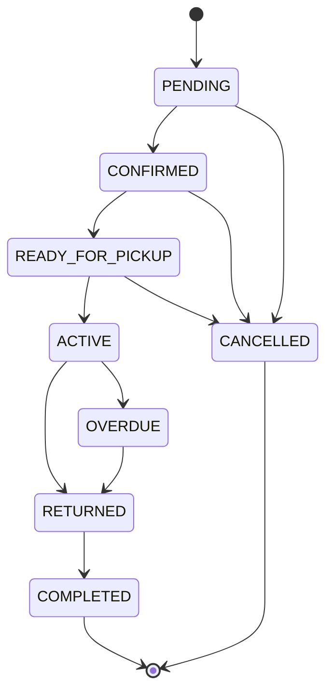

# Rental State Machine

## Statuses

| Status | Reserving | Meaning |
| --- | --- | --- |
| `PENDING` | Yes | Initial reservation state; the rental awaits confirmation. |
| `CONFIRMED` | Yes | The reservation is confirmed and awaits pickup preparation. |
| `READY_FOR_PICKUP` | Yes | Staff have prepared the reserved equipment for pickup. |
| `ACTIVE` | Yes | Equipment has been checked out to the customer. |
| `OVERDUE` | Yes | An active rental has passed its scheduled end time. |
| `RETURNED` | No | Equipment has been returned and awaits completion. |
| `COMPLETED` | No | The rental lifecycle has closed successfully. |
| `CANCELLED` | No | The reservation was cancelled before activation. |

`PENDING` is the only allowed initial status. `COMPLETED` and `CANCELLED` are terminal. `RETURNED` can advance only to `COMPLETED`.

## Allowed transitions

| From | To | Event meaning |
| --- | --- | --- |
| `PENDING` | `CONFIRMED` | Confirm the reservation. |
| `PENDING` | `CANCELLED` | Cancel before confirmation. |
| `CONFIRMED` | `READY_FOR_PICKUP` | Mark prepared for pickup. |
| `CONFIRMED` | `CANCELLED` | Cancel before preparation. |
| `READY_FOR_PICKUP` | `ACTIVE` | Complete checkout. |
| `READY_FOR_PICKUP` | `CANCELLED` | Cancel before checkout. |
| `ACTIVE` | `RETURNED` | Complete return processing. |
| `ACTIVE` | `OVERDUE` | Mark the active rental overdue. |
| `OVERDUE` | `RETURNED` | Complete return processing. |
| `RETURNED` | `COMPLETED` | Close the rental. |

Any actual status change absent from this table is forbidden. A no-op update that leaves `status` unchanged is allowed.

## Reserving statuses

These statuses continue to reserve their physical units for the rental period:

- `PENDING`
- `CONFIRMED`
- `READY_FOR_PICKUP`
- `ACTIVE`
- `OVERDUE`

These statuses do not block future allocation:

- `RETURNED`
- `COMPLETED`
- `CANCELLED`

Availability uses the half-open interval `[startAt, endAt)`. A new reserving rental may begin exactly when a prior reserving rental ends. A shared boundary is not an overlap.

## Database enforcement

The PostgreSQL proof separates value validation from transition validation:

1. The `rental_status` enum rejects a status outside the defined domain.
2. A `BEFORE INSERT OR UPDATE OF status` trigger rejects an explicit insert whose status is not `PENDING`.
3. The same trigger compares the persisted `OLD.status` with `NEW.status` and accepts only the edges above.
4. The row lock acquired by PostgreSQL for `UPDATE` serializes competing status changes. A concurrent updater evaluates against the current row version at `READ COMMITTED` rather than against a stale application read.
5. An `AFTER UPDATE OF start_at, end_at, status` trigger checks overlap whenever status changes across the reserving boundary and whenever a reserved period changes.

The status trigger does not schedule `ACTIVE -> OVERDUE` from the passage of time. A future scheduled job or application command must perform that update; the database will accept it only from `ACTIVE`.

## Forbidden examples

These examples are forbidden because each edge is absent from the transition table:

- `PENDING -> ACTIVE`
- `PENDING -> RETURNED`
- `PENDING -> COMPLETED`
- `CONFIRMED -> ACTIVE`
- `CONFIRMED -> COMPLETED`
- `READY_FOR_PICKUP -> RETURNED`
- `READY_FOR_PICKUP -> COMPLETED`
- `ACTIVE -> CANCELLED`
- `ACTIVE -> COMPLETED`
- `OVERDUE -> CANCELLED`
- `OVERDUE -> COMPLETED`
- `RETURNED -> ACTIVE`
- `RETURNED -> CANCELLED`
- `COMPLETED` or `CANCELLED` to any other state

`RETURNED -> ACTIVE` is deliberately forbidden. Reopening a returned rental would roll operational history backward and bypass the completed return path.

## Mermaid state diagram

The terminal arrows are visualization only. They do not add a business operation that bypasses the transition rules.

## API boundary

The database is the final authority for every state edge, but this repository does not implement an API. A future transition command must:

- Accept the rental identifier and intended target status or business event.
- Perform authorization for the initiating user's role.
- Update one rental in a database transaction.
- Map invalid edges to a conflict response.
- Avoid unrestricted status replacement endpoints.

Idempotency and command-payload details remain part of later API design.
