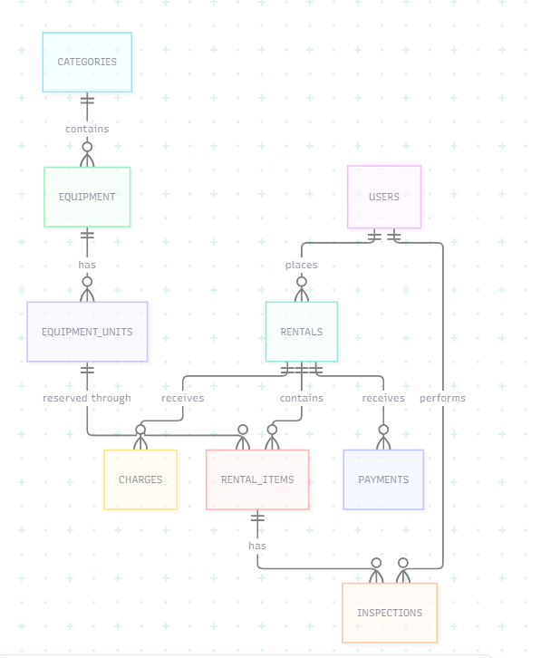
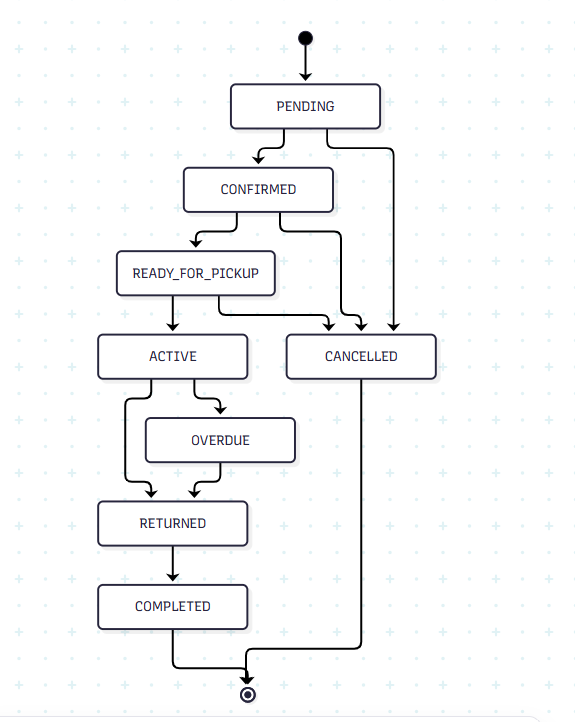
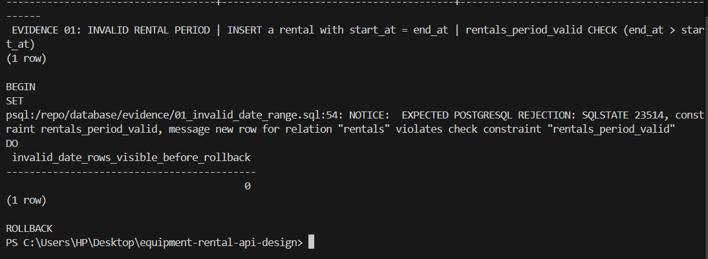
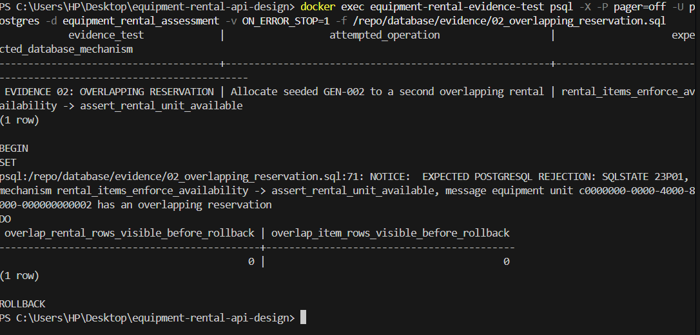
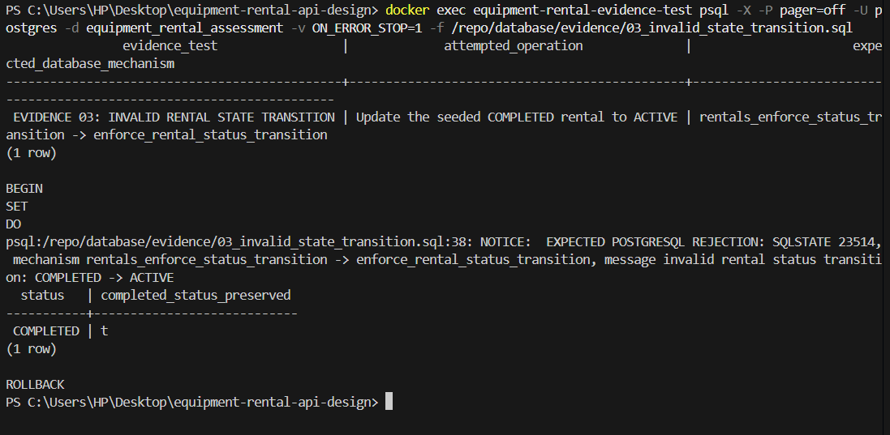
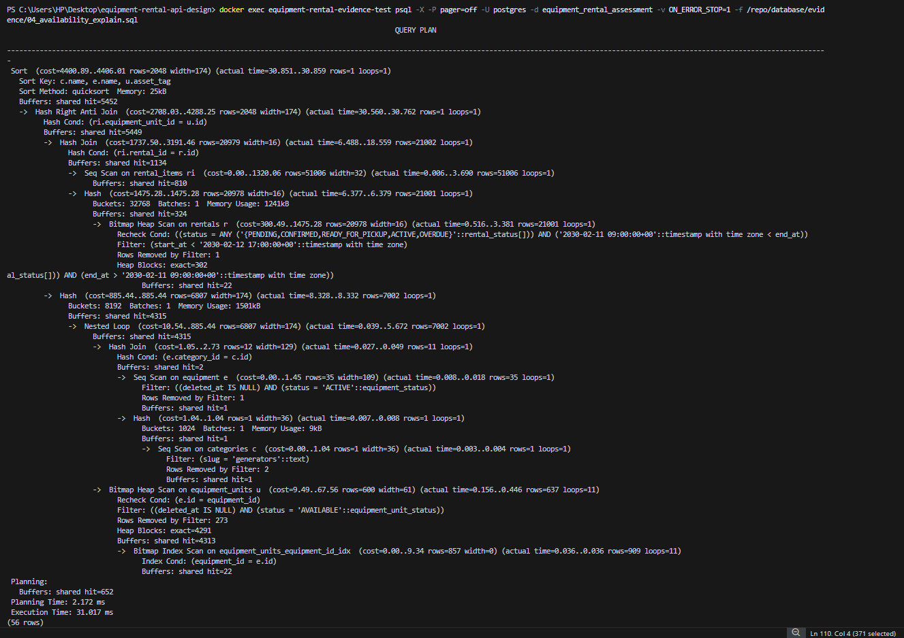
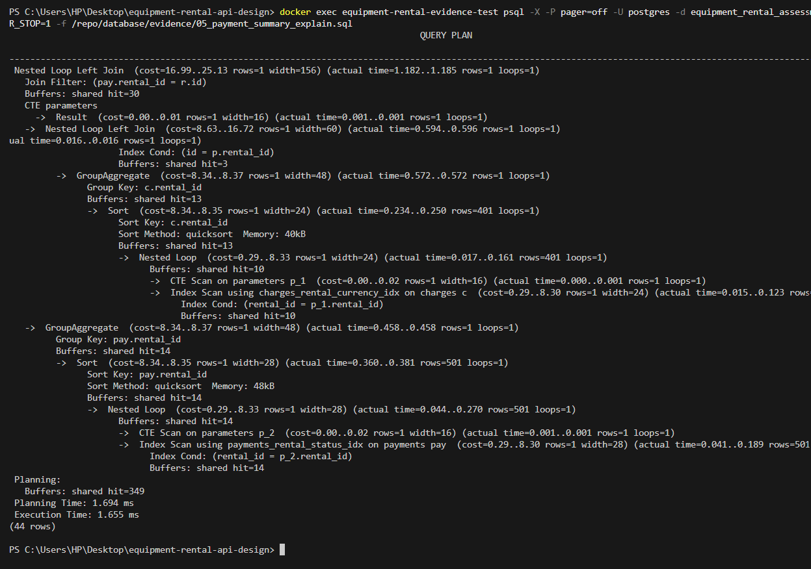

# Evidence Guide

`database/evidence/` holds the executable SQL proof. `evidence/` holds the seven captured PNG screenshots and the Mermaid source for the diagram screenshot. The repository generates no images and no terminal output: every PNG is a manual capture of real output, and none of them may be edited, reconstructed, cropped away from a rejection, or replaced with fabricated terminal text.

## Evidence inventory

| # | File | What it shows | Produced from |
| --- | --- | --- | --- |
| 1 | `01-er-diagram.png` | The nine-entity relationship view, including every relationship edge and cardinality marker. | `evidence/01-er-diagram.mmd`, which mirrors the compact diagram in `docs/data-model.md`. |
| 2 | `02-rental-state-machine.png` | All eight rental statuses and the ten permitted transitions. | The Mermaid state diagram in `docs/state-machine.md`. |
| 3 | `03-invalid-date-range.png` | The real `23514` rejection from `rentals_period_valid` for a zero-length rental period (`start_at = end_at`), with zero rows retained. | `database/evidence/01_invalid_date_range.sql` |
| 4 | `04-overlapping-reservation.png` | The real `23P01` rejection from `rental_items_enforce_availability` when `GEN-002` is reserved over an overlapping period. | `database/evidence/02_overlapping_reservation.sql` |
| 5 | `05-invalid-state-transition.png` | The real `23514` rejection from `rentals_enforce_status_transition` for `COMPLETED -> ACTIVE`, with the original status preserved. | `database/evidence/03_invalid_state_transition.sql` |
| 6 | `06-availability-explain.png` | The `EXPLAIN (ANALYZE, BUFFERS)` plan for the half-open availability search against the volume fixture. | `database/evidence/04_availability_explain.sql` |
| 7 | `07-payment-summary-explain.png` | The `EXPLAIN (ANALYZE, BUFFERS)` plan for the payment-summary aggregation against the volume fixture. | `database/evidence/05_payment_summary_explain.sql` |

The two plan screenshots are the only record of which nodes PostgreSQL actually chose. The documents deliberately never transcribe them, so read the screenshots rather than trusting a prose summary. Both scripts are plain `EXPLAIN (ANALYZE, BUFFERS)`; they never disable sequential scans or force an index, and a `Seq Scan` in either plan is a legitimate planner decision that must stay visible.

## Screenshots

### 1. ER and data-model diagram



Every child side is zero-or-more. The schema does not enforce one-or-more items per rental, so the diagram must not claim it.

### 2. Rental state machine



### 3. Invalid rental period is rejected



### 4. Overlapping reservation is rejected



### 5. Forbidden state transition is rejected



### 6. Availability query plan



### 7. Payment-summary query plan



## Reproducing the SQL evidence

PostgreSQL 17 is required. It is **not** bundled with this repository, and neither is Docker. The workflow below uses a disposable `postgres:17` container, so nothing needs to be installed as a PostgreSQL service and nothing is published to a host port.

The container name, database name, and password below are throwaway local values for a container that is deleted afterwards. They are not credentials for anything real, and no real credential belongs in this repository or in a screenshot.

### Start a disposable container

```powershell
$Container = "equipment-rental-pg"
$Db = "equipment_rental"
$PgUser = "evidence"

docker run --rm -d --name $Container `
    -e POSTGRES_USER=$PgUser `
    -e POSTGRES_PASSWORD=local_evidence_only `
    -e POSTGRES_DB=$Db `
    postgres:17
```

No `-p` flag is used, so the container is reachable only through `docker exec`. Wait until the server is ready:

```powershell
docker exec $Container pg_isready -U $PgUser -d $Db
```

### Load the migration and the small demo seed

The demo seed is the small deterministic dataset used by the queries and the three rejection scripts. Load it first.

```powershell
function Invoke-Psql([string[]]$Sql) {
    $Sql -join "`n" | docker exec -i $Container psql -X -U $PgUser -d $Db -v ON_ERROR_STOP=1 -f -
    if ($LASTEXITCODE -ne 0) { throw "psql failed with exit code $LASTEXITCODE." }
}

Invoke-Psql @("$(Get-Content -Raw -LiteralPath 'database\migrations\001_initial_schema.sql')")
Invoke-Psql @("$(Get-Content -Raw -LiteralPath 'database\seeds\001_demo_data.sql')")
```

`001_demo_data.sql` is intended for one clean load into an empty database. It is not a reset script, so drop and recreate the database before reloading it.

### Run the five assessment queries and the three rejection scripts

Each of these is read-only or self-rolling-back, so they can run in any order.

```powershell
foreach ($File in @(
    "database\queries\01_manage_equipment.sql",
    "database\queries\02_search_availability.sql",
    "database\queries\03_create_rental.sql",
    "database\queries\04_checkout_return.sql",
    "database\queries\05_payment_summary.sql",
    "database\evidence\01_invalid_date_range.sql",
    "database\evidence\02_overlapping_reservation.sql",
    "database\evidence\03_invalid_state_transition.sql"
)) {
    Invoke-Psql @("$(Get-Content -Raw -LiteralPath $File)")
}
```

`03_create_rental.sql` ends with `ROLLBACK`, and so do the three rejection scripts, so none of them changes the loaded state.

### Load the optional volume fixture and capture plans

The second seed is a separate, much larger deterministic dataset used only for query-plan evidence. It is optional: skip it unless you are recapturing screenshots 6 and 7.

```powershell
Invoke-Psql @("$(Get-Content -Raw -LiteralPath 'database\seeds\002_query_plan_fixture.sql')")
Invoke-Psql @("$(Get-Content -Raw -LiteralPath 'database\evidence\04_availability_explain.sql')")
Invoke-Psql @("$(Get-Content -Raw -LiteralPath 'database\evidence\05_payment_summary_explain.sql')")
```

The fixture uses `generate_series`, leaves the demo seed untouched, and runs `ANALYZE` without changing planner settings.

### Tear down

```powershell
docker stop $Container
```

`--rm` means the container is removed on stop, so nothing is left behind.

## Manual capture order

When recapturing, follow this order so each screenshot has a known starting state.

1. Render and capture the compact ER diagram from `evidence/01-er-diagram.mmd`.
2. Render and capture the state diagram from `docs/state-machine.md`.
3. Create or reset the database, then apply the migration and the demo seed.
4. Capture the three rejection scripts in filename order: `01`, `02`, `03`.
5. Load the volume fixture once.
6. Capture the two `EXPLAIN` scripts in filename order: `04`, then `05`.

For terminal captures, maximize the window, use a readable font, capture the complete output without cropping, and clear the host terminal before each command so the output starts at the top of the window.

## When a screenshot must be recaptured

A screenshot goes stale as soon as the source it renders changes.

| Change | Recapture |
| --- | --- |
| Any edit to `evidence/01-er-diagram.mmd` or the compact diagram in `docs/data-model.md` | `01-er-diagram.png` |
| Any edit to the Mermaid state diagram in `docs/state-machine.md` | `02-rental-state-machine.png` |
| Any edit to a `database/evidence/0[1-3]_*` script or to the rejection behaviour it exercises | the matching screenshot |
| Any edit to a `database/evidence/0[45]_*` script or to the fixture it runs against | the matching screenshot |
| Cosmetic edits to a query that an evidence script does not execute | no recapture needed |

The current state: `evidence/01-er-diagram.mmd` was corrected so the rental-to-item edge reads zero-or-more, which matches what the migration enforces. The diagram source changed, so **`01-er-diagram.png` must be recaptured** by a human from the updated source. The other six screenshots still match their sources.
